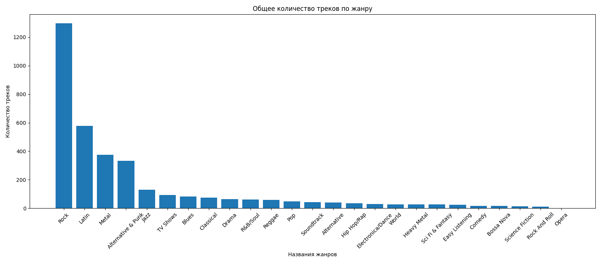
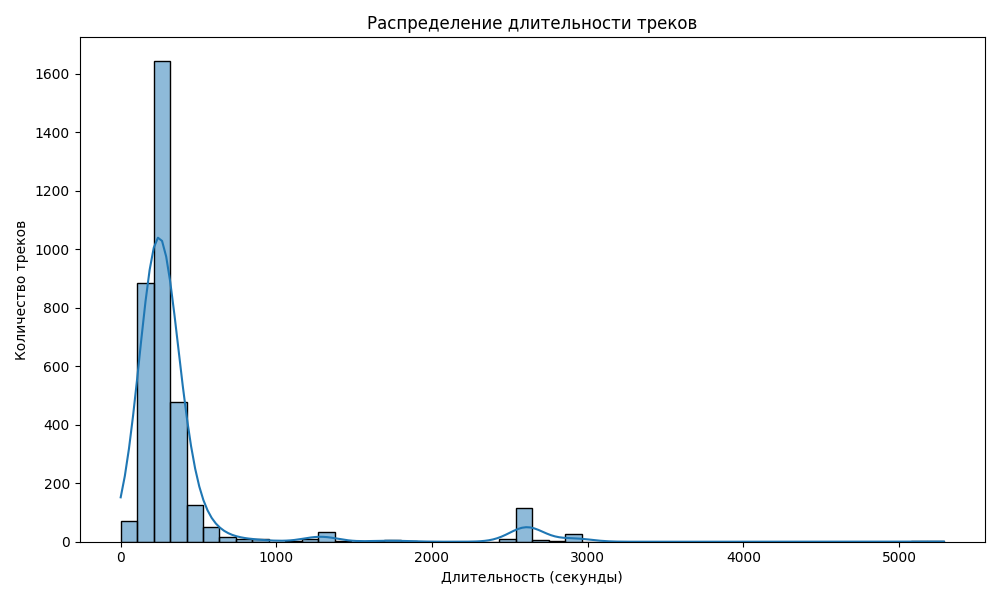
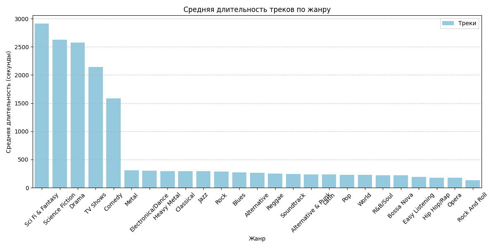
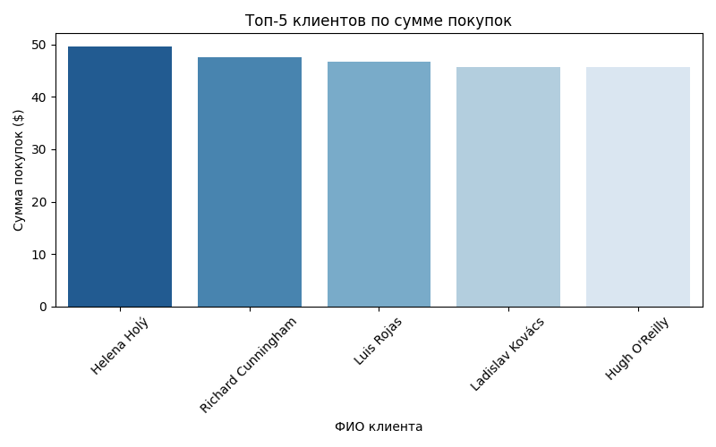

# Анализ базы данных Chinook (SQL + Python)

Анализ учебной базы данных музыкального магазина Chinook (SQLite) с помощью SQL-запросов, pandas и визуализации. Проект показывает работу с базами данных: JOIN, GROUP BY, агрегатные функции, оконный анализ и построение сводных таблиц.

## Данные

`chinook_sqlite.db` — стандартная учебная база данных со следующими таблицами: `Track`, `Album`, `Artist`, `Genre`, `Customer`, `Invoice`, `InvoiceLine` и др.

## Инструменты

Python, sqlite3, pandas, matplotlib, seaborn

## Задачи и результаты

### 1. Список таблиц в базе данных

```sql
SELECT name FROM sqlite_master WHERE type='table'
```
Получен список из 11 таблиц (Album, Artist, Customer, Employee, Genre, Invoice, InvoiceLine, MediaType, Playlist, PlaylistTrack, Track).

### 2. Анализ структуры таблицы Track

Загрузка таблицы в DataFrame, проверка типов данных (`.info()`) и пропусков (`.isnull().sum()`). Пропуски найдены только в колонке `Composer` — ожидаемо, не все треки имеют указанного автора.

### 3. Количество треков по жанрам

```sql
SELECT g.Name, COUNT(t.TrackId) AS Total
FROM genre g
JOIN track t ON g.GenreId = t.GenreId
GROUP BY g.Name
ORDER BY Total DESC
```



**Вывод:** больше всего треков относится к жанру Rock — значительный отрыв от остальных жанров.

### 4. Распределение длительности треков

```sql
SELECT Milliseconds / 1000.0 AS Seconds FROM Track
```



**Вывод:** большинство треков имеют длительность около 230 секунд (~3.5 минуты) — типичная длина поп/рок трека, распределение близко к нормальному с правым хвостом (единичные длинные записи).

### 5. Средняя длительность треков по жанрам

```sql
SELECT g.Name, AVG(t.Milliseconds) / 1000.0 AS avg_length
FROM Track t
JOIN Genre g ON g.GenreId = t.GenreId
GROUP BY g.Name
ORDER BY avg_length DESC
```



**Вывод:** жанр Sci Fi & Fantasy имеет наибольшую среднюю длительность треков — логично, так как в эту категорию обычно попадают аудиокниги/радиопостановки, а не отдельные песни.

### 6. Сводная таблица: альбом × жанр

```sql
SELECT track.TrackId, album.Title AS Album_title,
       genre.Name AS Genre_name, track.Milliseconds
FROM Track
JOIN Album ON track.AlbumId = album.AlbumId
JOIN Genre ON track.GenreId = genre.GenreId
```

Построена сводная таблица (`pivot_table`) — средняя длительность трека в разрезе альбом × жанр, полезно для быстрого сравнения структуры альбомов.

### 7. Топ-5 клиентов по сумме покупок

```sql
SELECT customer.CustomerId,
       customer.FirstName || ' ' || customer.LastName AS customer_name,
       SUM(invoice.Total) AS total_spent
FROM customer
JOIN invoice ON invoice.CustomerId = customer.CustomerId
GROUP BY customer.CustomerId
ORDER BY total_spent DESC
LIMIT 5
```



**Вывод:** наибольшую сумму покупок за всё время сделала клиентка Helena Holý.

## Как запустить

```bash
pip install -r requirements.txt
python analysis.py
```
Графики сохранятся рядом со скриптом (4 файла .png).

## Файлы

| Файл | Описание |
|---|---|
| `analysis.py` | Основной скрипт анализа |
| `chinook_sqlite.db` | База данных |
| `requirements.txt` | Зависимости |
